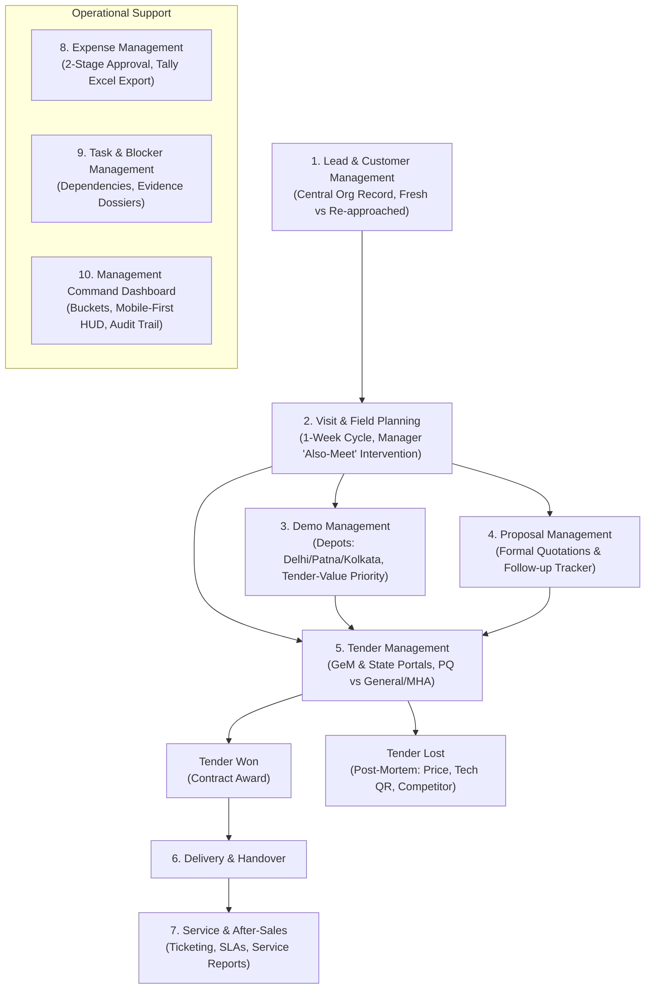

# Arihant BOS — Operational Business Blueprint & Verification Specification

**Document Reference:** `ARH-BOS-VERIFICATION-SPEC-V1`  
**Governing Documents:**
1. **Official Scope Blueprint:** [Arihant Trading Corporation BOS Scope Blueprint.pdf](file:///home/dheerajsingh/Desktop/arihant-bos/docs/Arihant%20Trading%20Corporation%20BOS%20Scope%20Blueprint.pdf) *(Version 2.0, BDA Technologies)*
2. **Operational Alignment Meeting:** *Impromptu Google Meet — September 20 (Ambesh Tiwari & Dheeraj Singh)*
3. **Repository UI/Architecture Contract:** [AGENTS.md](file:///home/dheerajsingh/Desktop/arihant-bos/AGENTS.md) & [.agents/rules/design-system.md](file:///home/dheerajsingh/Desktop/arihant-bos/.agents/rules/design-system.md)

---

## 1. MANDATORY VERIFICATION CONTRACT (Rule 0)

> [!IMPORTANT]
> **RULE FOR ALL AI AGENTS & DEVELOPERS:**
> Whenever the user instructs to **"build"**, **"create"**, **"modify"**, or **"edit"** any feature, module, API endpoint, schema, or UI view in Arihant BOS, you **MUST VERIFY** the implementation against this document and the official [Scope Blueprint PDF](file:///home/dheerajsingh/Desktop/arihant-bos/docs/Arihant%20Trading%20Corporation%20BOS%20Scope%20Blueprint.pdf).
>
> **Every build/edit instruction must pass the 7 Verification Gates defined in Section 14 before completion.**

---

## 2. Business Nature & Company Profile

### 2.1 The B2G Enterprise Model
- **Arihant Trading Corporation** is a premier **B2G (Business-to-Government)** enterprise.
- **Client Base**: Government Institutions, Ministries, Paramilitary & Armed Forces, State Police Forces, Public Sector Undertakings (PSUs), Airports, Seaports, and Railways.
  - *Key Accounts*: Delhi Police, BSF (Border Security Force), CRPF, CISF, Assam Rifles, Bihar Police, Kolkata Police, Indian Railways, Mumbai Port Trust, etc.
- **Primary Product Lines**: Specialized homeland security, screening, and surveillance equipment:
  1. **XBIS (X-Ray Baggage Inspection Systems)**: Dual-energy high-penetration airport/railway grade inspection systems.
  2. **DFMD (Door Frame Metal Detectors)**: Multi-zone pinpoint walk-through metal detection portals.
  3. **HHMD (Hand Held Metal Detectors)**: Ministry of Home Affairs (MHA) Qualitative Requirement (QR) compliant units.
  4. **UVSS (Under Vehicle Surveillance Systems)**: Fixed and mobile embedded color camera arrays.
  5. **Thermal Imaging & Night Vision Monoculars**: Border and perimeter tactical surveillance gear.

### 2.2 Core Operating Principle: *"Enter Once, Use Everywhere"* (§4)
- Field executives operate on the road and must **never** be required to do their work during the day and re-enter data at night for management reporting.
- Any operational action (a completed visit, a demo logged, a tender marked submitted, an expense submitted) must immediately and automatically propagate into:
  - Central customer interaction timeline
  - Regional Manager review queue
  - Sales & regional performance scorecards
  - Management Command Dashboard & alert feeds
  - Audit trail

### 2.3 Strict System Boundaries: What the BOS Is NOT (§3)
To preserve architectural focus, the BOS will **not** become an ERP. The following remain external:
1. **Accounting Ledger**: **Tally** remains the system of record for accounting. The BOS provides standardized expense review and **Excel export** for Tally ingestion.
2. **Automated Tender Submission**: Portal submissions into **GeM (Government e-Marketplace)** or State e-Procurement portals (e.g. Bihar tender portal) are done manually by authorized tender officers due to DSC tokens, OTPs, and CAPTCHAs. The BOS manages internal readiness, annexures, approvals, deadlines, and logs portal glitches.
3. **Automated Salary/Payroll Deductions**: Under §4 & §43, the BOS **never** automatically deducts salary or penalties. Instead, it compiles an objective **Performance Evidence Dossier** for human HR/Management review.
4. **General Inventory ERP & Quotation Engines**: Full warehouse accounting or algorithmic price bidding remain external.

---

## 3. Organizational Structure & 8-Role RBAC Matrix (§5)

| Role Code | Role Name | Operational Scope | Core Permissions & Approvals |
| :--- | :--- | :--- | :--- |
| `management` | Top Management / Director | All-India Enterprise | Full operational visibility, tender participation authorization, demo priority overrides, global audit logs, executive dashboards |
| `regional_manager` | Regional Manager | Assigned Zone / Region | Lead qualification, visit approvals, "Also-Meet" directives, Stage-1 expense verification, regional team oversight |
| `sales` | Sales Executive | Assigned Territory / Leads | Mobile field visits, lead creation, proposal requests, demo requests, visit updates, personal expense submission |
| `tender_team` | Tender Specialist | National GeM & State Bids | Bid identification, PQ compliance checking, document repository compilation, submission logging, win/loss post-mortems |
| `demo_team` | Demo Engineer / Depot Lead | Regional Depots (Delhi/Patna/Kolkata) | Equipment condition tracking, logistics dispatch, live on-site demonstration execution, outcome/failure analysis |
| `service_team` | Service Engineer | National Field Service | Breakdown ticket response, on-site diagnostics, parts replacement, service report submission with customer sign-off |
| `accounts` | Corporate Accounts | Financial Audit Desk | Stage-2 expense approval, GST verification, Tally Excel export generation |
| `admin` | System Administrator | Platform Infrastructure | Master data CRUD, user onboarding, role provisioning, audit trail review |

---

## 4. End-to-End Operational Lifecycle (10 Core Modules)



---

## 5. Module 1: Lead & Customer Management (§6, §7, §8)

### Core Rules & Meeting Nuances
1. **Organisation as Anchor Entity**: Every lead, physical visit, proposal, and tender is anchored to an immutable `organisations` record.
2. **Fresh vs. Re-Approached Lead Rule (§7)**:
   - **Fresh Lead**: An institution/department being approached for the first time.
   - **Re-Approached Prospect**: An institution previously visited or engaged. Instead of creating a duplicate record, the complete historical timeline (previous meetings, products discussed, prior sales reps, outcomes) remains attached to the single organisation.
3. **Capture Fields**:
   - Organization Name (e.g. *Bihar Police HQ*, *CISF Airport Division*)
   - Contact Person Name, Designation (e.g. *ADG Procurement*, *Store Officer*), Mobile Number, Email ID
   - Zone (North, East, West, South, North-East) & State/City
   - Sector/Department, Product Interest (XBIS, DFMD, HHMD, UVSS), Lead Source, Lead Category (`Active`, `Expected`, `Follow-Up`), Lead Probability (`High`, `Medium`, `Low`).
4. **Customer Interaction Timeline (§8)**: Chronological stream capturing Calls, Emails, WhatsApp notes, Physical Visits, Demos, Proposals, Tender discussions, and Service interactions.

---

## 6. Module 2: Visit & Field Planning (§9 – §12)

### Core Rules & Meeting Nuances
1. **Advance Planning Cycle (§9)**: Field reps submit planned field itineraries approximately **one week in advance** (Organisation, Location, Date, Contact Person, Purpose, Demo/Travel requirements).
2. **Manager "Also-Meet" Intervention Directive (§10)**:
   - *Scenario from Call*: A sales rep travels from Delhi to Patna (Bihar) to meet one specific department. The Regional Manager reviews the trip in BOS and identifies 2–3 nearby government departments in Patna.
   - The Manager can directly assign an **"Also-Meet" directive** linked to the same itinerary.
   - *Objective*: Maximize trip productivity, minimize repeat travel costs.
3. **Visit Modifications & Auditability (§11)**:
   - If a sales rep cancels, reschedules, or changes dates/destinations, the Manager is notified immediately with a mandatory written reason logged into the audit trail.
4. **Post-Visit Update (§12)**:
   - *Scenario from Call*: Rep visits, but the officer is unavailable or on leave. The rep immediately logs: `Meeting Not Completed - Officer on Leave`, setting a follow-up date.
   - If completed, rep logs: Person Met, Discussion Summary, Products Pitched, Demo Requirement, Opportunity Identified, Next Action Date.
   - Updates customer history and manager dashboard with zero manual duplicate entry.

---

## 7. Module 3: Demo Management & Fleet Logistics (§13 – §17)

### Core Rules & Meeting Nuances
1. **Heavy Demo Equipment Fleet & Depots (§15)**:
   - Security equipment (specifically X-Ray baggage scanners) are high-value and physically located across regional depots: **Delhi**, **Patna**, **Kolkata**.
   - Fleet statuses: `Available`, `Reserved`, `In Use / Deployed`, `Maintenance`.
2. **Tender-Value Conflict Resolution Principle (§16)**:
   - *Scenario from Call*: Rep A (e.g. Gulshan) and Rep B (e.g. Sahil) request the *same* demo machine for overlapping dates.
   - **Rule**: The demo machine is allocated to the opportunity with the **HIGHER TENDER / DEAL VALUE** or strategic significance, subject to Management / Depot Coordinator approval.
3. **Structured Demo Workflow (§14)**:
   `Requested` $\longrightarrow$ `Under Planning` $\longrightarrow$ `Equipment Reserved` $\longrightarrow$ `Team Assigned` $\longrightarrow$ `Confirmed` $\longrightarrow$ `Completed` *(or `Cancelled` / `Rescheduled`)*.
4. **Structured Demo Outcome & Failure Analysis (§17)**:
   - Crucial requirement: Understand *why* demos succeed or fail.
   - Mandatory failure categories:
     - `Product Limitation` (specs failed government qualitative requirements)
     - `Equipment Issue / Technical Failure` (machine broke down during trial)
     - `Customer Requirement Mismatch` (wrong tunnel size or dimension)
     - `Pricing Concern` (budget constraints)
     - `Decision-Maker Unavailable` (key tender committee absent)
     - `Competitor Preference`
     - `Demo Preparation Issue`
     - `Other` (with detailed remarks)

---

## 8. Module 4: Tender Management & GeM/State Procurement (§18 – §27)

### Core Rules & Meeting Nuances
1. **Portals Covered**: GeM (Government e-Marketplace), CPPP, and State Procurement Portals (e.g. Bihar e-Procurement Portal).
2. **Identification & Master Capture (§19)**:
   - Bid Number (e.g. `GEM/2026/B/9823412`), Authority/Department, Product, City, State, Zone, Tender Category, Publication Date, Submission Deadline (exact date & closing time, e.g. 15:00 hrs), EMD Fee, PBG, Bidder & OEM Turnover thresholds.
3. **Tender Classification (§20)**:
   - **PQ (Pre-Qualification)**: Vendor eligibility, technical compliance, past experience credentials.
   - **General / MHA**: Specific Ministry of Home Affairs qualitative requirements and direct bids.
   - **Other**: Commercial PSU tenders.
4. **13-Stage Finite State Machine (§23)**:
   `Identified` $\longrightarrow$ `Awaiting Internal Approval` $\longrightarrow$ `Approved / Rejected (Mgmt)` $\longrightarrow$ `Under Preparation` $\longrightarrow$ `PQ Submitted` $\longrightarrow$ `PQ Qualified` $\longrightarrow$ `Tender Submitted` $\longrightarrow$ `Technical Evaluation` $\longrightarrow$ `Commercial Evaluation` $\longrightarrow$ `Won / Lost / Cancelled / On Hold`.
5. **Urgency & Deadline Management (§24)**:
   - System highlights submissions closing within 7 days, urgent (≤ 48 hours), pending internal reviews, and unsubmitted technical folders.
6. **External Portal Issues Tracker (§25)**:
   - Tracks GeM/portal bugs (e.g. equipment category not appearing on GeM, DSC token signing failure, server gateway timeout), date, responsible officer, and escalation status.
7. **Win/Loss Post-Mortem Intelligence (§26)**:
   - **Won**: Capture award contract value, margin, supply deadline.
   - **Lost**: Mandatory capture of Winning Competitor, Winning L1 Price, Reason (`Pricing / L1 Threshold Missed`, `Technical Disqualification`, `Turnover / Eligibility Defect`, `Documentation / EMD Defect`, `Competitor Predatory Pricing`).

---

## 9. Module 5: Proposal Management (§28 – §30)

### Core Rules & Meeting Nuances
1. **Central Proposal Register**: Tracks every commercial quote submitted to clients.
2. **Fields**: Customer, Sector/Department, Product, Requested By, Proposal Author, Version Number, Quoted Value, Sent Date, Follow-up Owner, Next Follow-up Date.
3. **Workflow (§29)**:
   `Proposal Requested` $\longrightarrow$ `Under Preparation` $\longrightarrow$ `Ready for Review` $\longrightarrow$ `Approved` $\longrightarrow$ `Sent to Customer` $\longrightarrow$ `Follow-up Required` $\longrightarrow$ `Converted / Closed / Lost`.
4. **Follow-Up Accountability (§30)**:
   - Highlights proposals without follow-up, follow-ups due today, and stalled quotes.

---

## 10. Module 6: Service & After-Sales Management (§31 – §34)

### Core Rules & Meeting Nuances
1. **Post-Tender Support & Ticketing (§31)**:
   - Handles installed machines (X-Ray machines, DFMDs) experiencing technical breakdowns.
   - Ticket fields: Ticket Number, Customer, Contact Person, Location, Equipment Type, Serial Number, Complaint Description, Date Received, Priority (`Low`, `Medium`, `High`, `Critical / LD Risk`), Warranty Status (`In-Warranty`, `Under AMC`, `Out-of-Warranty / Billable`), Assigned Engineer, Planned Visit Date, Status.
2. **Service Workflow (§32)**:
   `Complaint Received` $\longrightarrow$ `Ticket Created` $\longrightarrow$ `Engineer Assigned` $\longrightarrow$ `Visit Scheduled` $\longrightarrow$ `Work in Progress` $\longrightarrow$ `Resolved` $\longrightarrow$ `Service Report Submitted` $\longrightarrow$ `Ticket Closed` *(Statuses: `Awaiting Part`, `Awaiting Customer`, `Escalated`, `Revisit Required`)*.
3. **Mandatory Service Report (§33)**:
   - Problem Identified, Action Taken, Parts Replaced, Warranty Status verified, Customer Sign-off/Confirmation, Next Revisit Required, Signed Service Report attachment.
4. **Service Dashboard KPIs (§34)**: Open tickets, overdue tickets, tickets awaiting parts, repeat complaints, average closure time, engineer workload.

---

## 11. Module 7: Field Expense Management & 2-Stage Approval (§35 – §37)

### Core Rules & Meeting Nuances
1. **Standardized Submission (§35)**:
   - Categories: `Travel (Train/Flight/Bus)`, `Hotel / Lodging`, `Local Conveyance (Auto/Taxi)`, `Food / Daily Allowance`, `Demo Expenses / Freight`, `Service Spares`, `Other`.
   - Fields: Employee, Visit/Trip Reference, Date, Category, Amount, Purpose, Customer/Project Reference, Receipt Image, Remarks.
2. **2-Stage Approval Workflow (§36)**:
   `Submitted` $\longrightarrow$ `Stage 1: Regional Manager Review` $\longrightarrow$ `Stage 2: Corporate Accounts Review` $\longrightarrow$ `Processed / Settled`.
   - **Anti-Fraud Rule**: System blocks self-approvals at both stages.
3. **Tally Accounting Export (§37)**:
   - Accounts desk has an **Excel Download** feature formatted for direct reconciliation and entry into **Tally**.

---

## 12. Module 8 & 9: Tasks, Blockers & Performance Evidence (§38 – §44)

### Core Rules & Meeting Nuances
1. **Task Assignment**: Assigned employee, reporting manager, priority, deadline, expected outcome, linked entity (lead, visit, tender, demo).
2. **Blocker Workflow (§41)**:
   - System distinguishes between poor execution and genuine external blockers:
     - `Management Approval Pending`
     - `Customer Dependency / Officer Absent`
     - `Vendor / OEM Dependency`
     - `Missing Technical Specifications`
     - `External Portal Issue (GeM Down)`
     - `Approved Sick / Casual Leave`
   - Manager can: *Accept Blocker* (extends deadline without penalty), *Reject Blocker*, *Reassign*, or *Escalate*.
3. **Employee Accountability & Evidence Dossiers (§42, §43)**:
   - Tracks on-time completions, delayed tasks, repeat misses, approved vs unapproved delays.
   - **Strict Rule**: BOS does **not** auto-deduct salary. Generates verifiable Dossiers for HR management.
4. **Regional & Rep Scorecards (§44)**:
   - Evaluates conversion rates, completed vs cancelled visits, demo success ratios, proposal conversion rates, and tender win rates.

---

## 13. Module 10: Management Command Dashboard & Mobile-First UX (§45 – §48)

### Core Rules & Meeting Nuances
1. **Executive Command Buckets (§45)**:
   - High-level widgets: Active Tenders closing ≤ 48h, Demos scheduled this week, Equipment depot conflicts, Urgent service tickets, Pending expense batches, Critical blockers.
2. **Real-Time Notification & Escalation Hub (§46)**:
   - Automated triggers for approaching bid deadlines, new demo requests, visit cancellations, stage-1 expense clearances, and unresolved service tickets.
3. **Immutable Audit Trail (§47)**:
   - All critical actions (tender deadline extensions, approvals/rejections, visit cancellations, equipment reservations, ticket reassignments) log `user_id`, `action`, `previous_value`, `new_value`, and `timestamp`.
4. **Mobile-First Experience for Field Staff (§48)**:
   - Sales reps and engineers are constantly traveling on the road ("on the go").
   - **Strict UX Guideline**: Ultra-clean mobile layout, pre-filled forms, minimal free-text typing, accessible dropdowns, tap-friendly status toggles, zero complex multi-tab desktop clutter on small viewports.

---

## 14. THE 7 VERIFICATION GATES (Mandatory on Every Build / Edit)

Before any build or edit task is marked complete, the AI agent / developer must verify compliance across these 7 Gates:

```
[ ] GATE 1: Scope & Business Logic Check
    - Does this change violate "What the BOS Is Not" (§3: no Tally replacement, no auto-bidding bots, no auto-salary deductions)?
    - Does it adhere to the B2G workflow (Organisation anchor, Fresh vs Re-approached, Tender-Value demo priority)?

[ ] GATE 2: Role-Based Authorization & Territorial Scoping
    - Are RBAC checks enforced across the 8 roles (§5)?
    - Unless role is 'management' or 'admin', is query filtered by user.region_id or user.id?

[ ] GATE 3: Data Schema & Shared Package Alignment
    - Are all DTOs, enums, status transitions, and currency formatters defined in @arihant/shared?
    - Are Kysely queries strictly used for PostgreSQL database interactions?

[ ] GATE 4: Design System & Visual Tokens Check
    - Canvas Background: Warm linen #F6F5F1 (bg-[#F6F5F1])
    - Surfaces: Crisp White #FFFFFF cards (bg-white), subtle #FBFAF7
    - Borders: Base #DCD8CE, dividers #ECE9E2
    - Brand Colors: Deep Teal #0F5E63, Terracotta #9A3412, Dark Navy #14213D
    - Typography: 'Source Serif 4' headings, 'IBM Plex Sans' body, 'IBM Plex Mono' amounts/codes
    - Primitives: Imported strictly from @/components/ui (PageContainer, Card, Button, Input, etc.)
    - NO dark mode / dark backgrounds permitted!

[ ] GATE 5: Mobile-First Usability Check (§48)
    - Are forms streamlined with dropdowns, pre-fills, and quick actions?
    - Does the UI render cleanly on mobile viewports (≤ 430px) without horizontal clipping?

[ ] GATE 6: Audit Trail & Notification Logging (§46, §47)
    - Are critical state transitions (approvals, cancellations, deadline changes) committed to audit logs?
    - Are appropriate Domain Events emitted via EventEmitter2 / transactional outbox?

[ ] GATE 7: Zero-Error Compilation Verification
    - Run: pnpm --filter @arihant/web exec tsc --noEmit (Must exit with 0 errors)
    - Run: pnpm --filter @arihant/api exec tsc --noEmit (Must exit with 0 errors)
```

---

## 15. Summary of Key Files for Cross-Verification

- **Primary Blueprint PDF**: [docs/Arihant Trading Corporation BOS Scope Blueprint.pdf](file:///home/dheerajsingh/Desktop/arihant-bos/docs/Arihant%20Trading%20Corporation%20BOS%20Scope%20Blueprint.pdf)
- **Design System Rule**: [.agents/rules/design-system.md](file:///home/dheerajsingh/Desktop/arihant-bos/.agents/rules/design-system.md)
- **Agent Guidelines**: [AGENTS.md](file:///home/dheerajsingh/Desktop/arihant-bos/AGENTS.md)
- **Database Schema**: [arihant_bos_schema.sql](file:///home/dheerajsingh/Desktop/arihant-bos/arihant_bos_schema.sql)
- **Detailed Module Specs**:
  - [Module 1: Lead & Customer Management](file:///home/dheerajsingh/Desktop/arihant-bos/docs/MODULE_1_LEAD_AND_CUSTOMER_MANAGEMENT_WORKFLOW.md)
  - [Module 2: Visit & Field Planning](file:///home/dheerajsingh/Desktop/arihant-bos/docs/MODULE_2_VISIT_AND_FIELD_PLANNING_WORKFLOW.md)
  - [Module 3: Demo Management](file:///home/dheerajsingh/Desktop/arihant-bos/docs/MODULE_3_DEMO_MANAGEMENT_WORKFLOW.md)
  - [Module 4: Tender Management](file:///home/dheerajsingh/Desktop/arihant-bos/docs/MODULE_4_TENDER_MANAGEMENT_WORKFLOW.md)
  - [Module 5: Proposal Management](file:///home/dheerajsingh/Desktop/arihant-bos/docs/MODULE_5_PROPOSAL_MANAGEMENT_PIPELINE.md)
